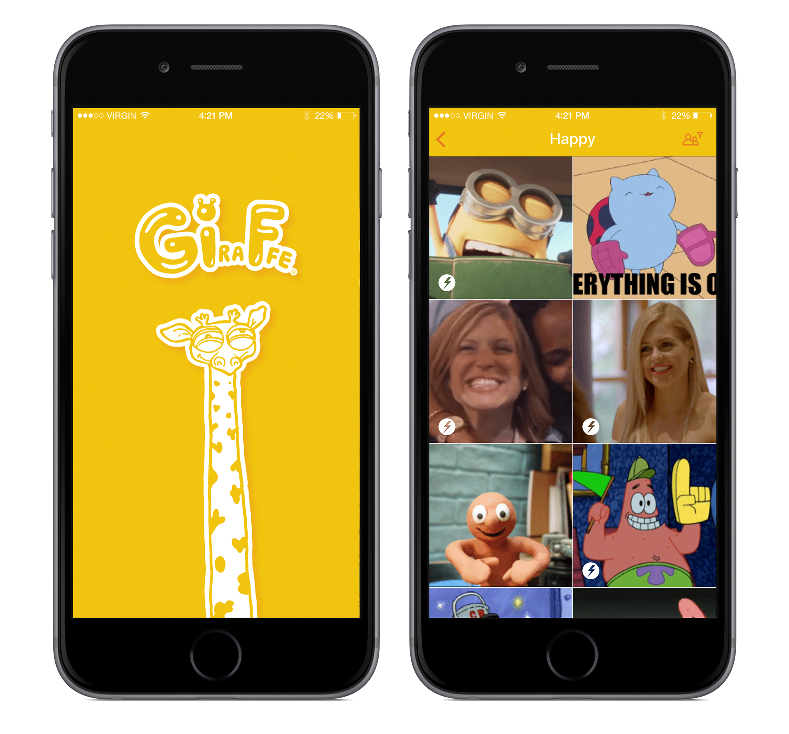

# [Repo is archived by the author]

# Giraffe

iOS client for Giphy (http://giphy.com) written in Swift with ReactiveCocoa

# Requirements
- iOS 10.0 Beta
- Xcode 8 Beta 2
- Swift 2.3
- Carthage

# Why Swift 2.3 ?

Swift 2.3 was chosen for initial version of the app, because at the time, not many open-source libraries were migrated to Swift 3. However, author's intention was to use latest tools and migrate 3rd party frameworks by himself (when needed) with less effort than same migration from Swift 2.2 to Swift 3 might have been required. 

The following quote from [Swift 3 and Xcode 8](https://developer.apple.com/swift/blog/?id=36) blogpost explains Swift 2.3 support in Xcode 8.

> Swift 3 is the primary development language supported within Xcode 8 so there are a couple notes to consider if you chose to continue using Swift 2.3. First, Swift 2.3 and Swift 3 are not binary compatible so your app's entire code base needs to pick one version of Swift. Both versions are fully supported by the compiler, SDKs, and debugger, but other features of the IDE may not work with Swift 2.3. For instance, Playgrounds in Xcode only work with Swift 3, and notably the Swift Playgrounds app for iPad also uses Swift 3. Xcode project templates all use Swift 3, and all documentation is presented in a format appropriate for Swift 3.

Eventually, author admits that using Swift 2.3 slowed down the development, because:
* [Nuke](https://github.com/kean/Nuke) required [migration to Swift 2.3](https://github.com/evgeniyd/Nuke/tree/Swift_2_3)
* [ReactiveCocoa](https://github.com/ReactiveCocoa/ReactiveCocoa)'s Swift 2.3 branch was under development at the time by contributors (now merged in [v4.2.2 release](https://github.com/ReactiveCocoa/ReactiveCocoa/releases/tag/v4.2.2))
* Setup with Carthage took more time to figure out
* Xcode 8 (Beta) & Xcode 7, both had difficulties working simultaneously

# Setup

As mentioned above, the current version of the app is written in Swift 2.3 Xcode 8 (both are in beta now). Because of this, setup takes several steps (not just few). 

Open Terminal and change the default `xcodebuild` to Xcode 8 beta

    $ sudo xcode-select --switch /Applications/Xcode-beta.app/Contents/Developer

`cd` to the folder you've cloned the repo to

    $ cd /Path/To/Repo/Giraffe/
    
Bootstrap but don't build

    $ carthage bootstrap --no-build
    
With Swift 2.3's toolchain, build 3rd party libraries

    $ TOOLCHAINS=com.apple.dt.toolchain.Swift_2_3 carthage build --platform iOS
    
In order to build & run the app on a device, set the Development Team for the following targets:
* GiraffeKit framework
* Giraffe-iOS

# What
*Architecture:*
* [x] MVVM
* [x] [FRP](https://en.wikipedia.org/wiki/Functional_reactive_programming) via [ReactiveCocoa](https://github.com/ReactiveCocoa/ReactiveCocoa)
* [x] iOS Dynamic Framework with common code
* [x] Protocol Extensions, Generics, Closures, etc..
* [ ] Migrate to Swift 3
* [ ] Pagination for search results
* [ ] Refactoring ViewModels [DRY](https://en.wikipedia.org/wiki/Don%27t_repeat_yourself)
* [ ] Error handling (SignalProducer in particular)
* [ ] Retry request after failure
* [ ] Unit-tests
* [ ] Reactive object mapping
* [ ] Document the GiraffeKit framework's code
* [ ] WebP support

*Features:*
* [x] Trending list
* [x] Search GIF by term
* [x] Denote trending GIFs in search results
* [x] Filter to only family friendly GIFs
* [ ] Pull-to-refresh
* [ ] Download still images prior to downloading animated ones
* [ ] GIF preview via [Peek and Pop](http://www.apple.com/iphone-6s/3d-touch/)
* [ ] Sharing
* [ ] Play/Stop animation control
* [ ] SiriKit for searching GIFs?

# Credits

The app's look and feel wouldn't be possible without these guys:
* [Lina Kononenko](https://www.facebook.com/linakononenko) (UI/UX)
* [Max Semenenko](https://www.facebook.com/max.nitsa) (Giraffe arts)

# License

Giraffe is available under the MIT license. See the [LICENSE](LICENSE) file for more info.
